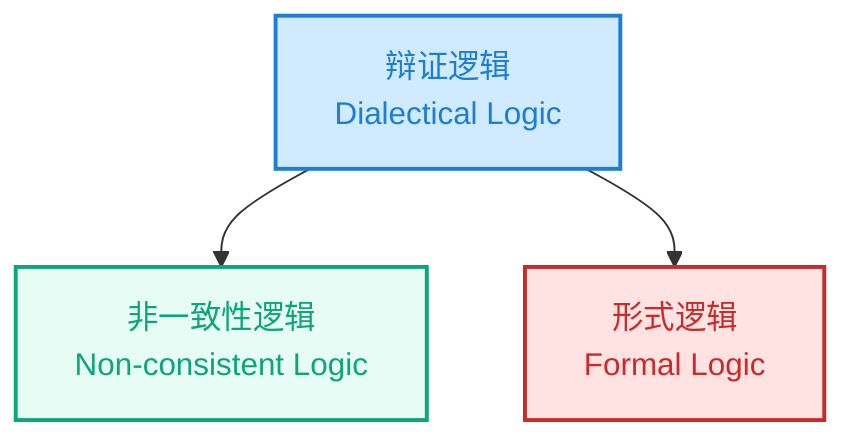
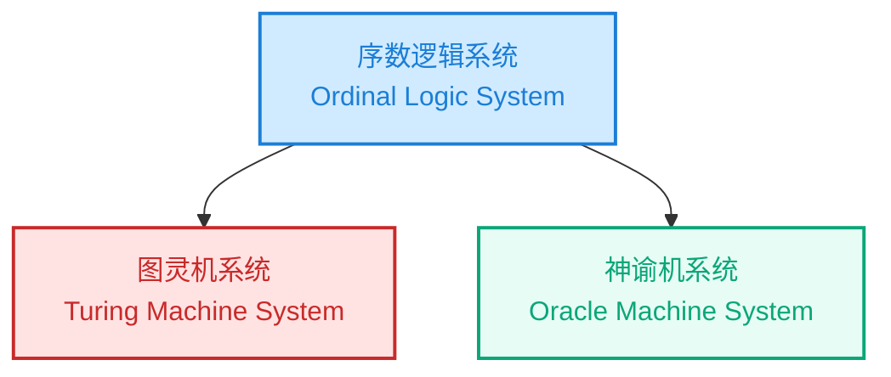

# 从形式逻辑到辩证逻辑：图灵机、序数逻辑与比特币的超形式系统

## 摘要
本文探讨了从形式逻辑到辩证逻辑的哲学与计算机理论演进，并以比特币为实例揭示其如何超越一致性系统而趋向完备性系统。文章首先对比形式逻辑与辩证逻辑，随后引入图灵机系统与图灵序数逻辑系统的对应关系，最后分析比特币如何通过交易验证、区块选择与最长链原则，实现一致性与完备性的统一，从而构建出一个“超形式系统”。

---

## 1. 逻辑层：形式逻辑与辩证逻辑
- **形式逻辑**：以一致性为目标，遵循同一律、排中律与不矛盾律，排斥矛盾的存在，强调确定推理的可靠性。
- **辩证逻辑**：以完备性为目标，容许矛盾的存在并强调对立统一。矛盾不被视为错误，而是推动系统演化的动力。
- **关系**：形式逻辑仅是辩证逻辑的真子集。辩证逻辑不仅涵盖了无矛盾的一致性逻辑，还包括了矛盾对立与动态统一的非一致性逻辑。

### 包含关系示意图

## 2. 计算机理论层：图灵机系统与序数逻辑系统
* **图灵机系统**：作为形式化计算模型，解决一致性可计算的问题。它既可描述确定性计算，也可模拟非确定性计算，但始终受限于哥德尔不完备性，无法在系统内消解不可判定问题。
* **序数逻辑系统**：图灵在博士论文中提出，通过“超穷迭代”与“神谕机”扩展图灵机的推理能力。这一系统容许在矛盾和不可判定性边界中继续进行演化与裁决，体现了辩证逻辑的精神。
* **对照**：图灵机系统对应形式逻辑的“一致性”；神谕机系统对应非形式系统的直觉矛盾；序数逻辑系统对应辩证逻辑的“完备性”。

### 包含关系示意图

## 3. 区块链层：比特币作为超形式系统
* **一致性层面**：
    * 交易验证（TX） = 图灵机系统的运作，确保每笔交易在局部上满足一致性。
    * 出块过程遵循形式逻辑原则，避免矛盾与错误。
* **完备性层面**：
    * 区块选择机制（分叉裁决）相当于神谕机的作用，解决同一高度的分叉问题。
    * 最长链原则与PoW工作量证明构成了“超穷迭代”的过程，使系统能够在矛盾（分叉）中实现统一与演化。
    * 时间戳链条不仅维持一致性，更不断生成新的“哥德尔信息”，体现出完备性的自我扩展。
* **结论**：比特币并非仅仅是一个一致性验证系统，而是通过引入超越形式逻辑的机制，构建了一个具有辩证逻辑特征的“超形式系统”。

---

## 结论
本文通过三层对照（逻辑学、计算理论与区块链实践），揭示了形式逻辑与辩证逻辑的关系，以及其在计算机科学与比特币系统中的具体化。形式逻辑保证一致性，但不足以解释演化与矛盾的统一；辩证逻辑则在容纳矛盾中追求完备。比特币通过交易验证、神谕式的分叉裁决和最长链迭代，将这两种逻辑统一起来，成为首个现实中运作的“超形式系统”。
